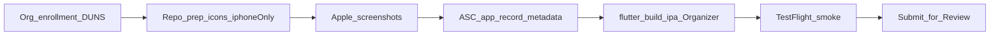

# feat: Apple App Store first submission

## Goal Capsule

Get **fxrows** (`com.wynpakt.fxrows`) accepted on the Apple App Store via a **Wynpakt organization** Apple Developer Program membership and a **manual Mac + Xcode** first upload. Repo work: iOS readiness fixes, Apple screenshot assets, and a durable checklist doc modeled on [docs/PLAY_STORE.md](docs/PLAY_STORE.md). Operator work (you): enrollment, App Store Connect, archive upload, TestFlight smoke, Submit for Review.

**Success:** App appears on the App Store under Wynpakt; privacy URL/support emails match Play; listing copy stays informational-FX (not trading); repo documents the path for the next release.

## Problem Frame

Android Play path already exists ([docs/PLAY_STORE.md](docs/PLAY_STORE.md)). iOS is buildable but not store-ready: Flutter default App Icons, universal iPhone+iPad targeting (forces iPad listing assets), no App Store runbook, Play screenshots at 864×1928 are the wrong Apple sizes, and no Developer Team is configured yet.

## Session-settled decisions

- Full first-submission path (account + listing + review), not tech-only
- New Apple Developer Program membership as **Organization (Wynpakt)** — plan ~1–2 weeks for D-U-N-S + identity review *(session-settled: user-directed — chosen over Individual for seller branding consistency with Play)*
- Manual Mac + Xcode / Organizer (or Transporter) — **no CI/IPA automation in this effort** *(session-settled: user-directed — chosen over CI)*
- **iPhone-only for v1** — set `TARGETED_DEVICE_FAMILY = 1`; skip iPad screenshots *(session-settled: user-directed — chosen over staying universal)*

## Product Contract (bootstrap)

### Requirements

- R1. User can obtain fxrows from the Apple App Store on iPhone under seller Wynpakt.
- R2. Bundle ID remains `com.wynpakt.fxrows` (already set in [app/ios/Runner.xcodeproj/project.pbxproj](app/ios/Runner.xcodeproj/project.pbxproj)).
- R3. Listing + App Privacy + in-app legal URL use `https://wynpakt.com/app/fxrows/privacy/`; support `fxrows@wynpakt.com`.
- R4. Marketing and review copy: informational FX only; Frankfurter = aggregated/indicative, not unmodified “ECB reference rates”; no settlement/trading claims (same hygiene as Play).
- R5. App ships branded App Icon (not Flutter logo); iPhone App Store screenshots at required sizes.
- R6. Durable operator guide lives at `docs/APP_STORE.md` and is linked from HANDOFF/README like Play.

### Scope Boundaries

**In scope:** enrollment checklist, iPhone-only project tweak, icons, Apple screenshots under `store/ios/`, export-compliance plist key, Privacy Manifest verification after first archive, APP_STORE.md + cross-links, privacy.md iOS/Keychain note, App Privacy / age-rating / category draft answers.

**Out of scope:** Android changes; CI IPA; Mac Catalyst / macOS App Store; ASO campaigns; IAP/Paid Apps; post-reject redesign beyond copy fixes in the checklist.

### Actors / Flows

- A1. Account Holder (you) — enrolls org, accepts ASC agreements, submits for review
- A2. Implementer — lands repo prep + docs on a machine with Flutter + Xcode
- F1. Org enrollment → certificates via Automatic Signing → ASC app record → archive upload → TestFlight smoke → App Review → Ready for Sale

## Key Technical Decisions

- KTD1. Mirror [docs/PLAY_STORE.md](docs/PLAY_STORE.md) structure for `docs/APP_STORE.md` (Reference table → Phase 0…E with copy-paste drafts). *(session-settled pattern: extend existing Play checklist)*
- KTD2. iPhone-only: change all `TARGETED_DEVICE_FAMILY` from `"1,2"` to `"1"` in the Runner pbxproj configs.
- KTD3. Regenerate full [app/ios/Runner/Assets.xcassets/AppIcon.appiconset](app/ios/Runner/Assets.xcassets/AppIcon.appiconset) from branded master (source: [store/icon-512.png](store/icon-512.png) or a new opaque 1024×1024 without alpha under `store/ios/`).
- KTD4. Set `ITSAppUsesNonExemptEncryption` = `false` in [app/ios/Runner/Info.plist](app/ios/Runner/Info.plist) (HTTPS/system crypto only) so ASC export Qs stay skipped.
- KTD5. Do **not** invent a speculative app Privacy Manifest up front. After first archive: open Privacy Report; if Flutter/plugins already supply required manifests and upload is clean, document “verify each release.” Only add Runner `PrivacyInfo.xcprivacy` if Xcode/ASC reports a gap (ITMS-91053 or missing reason API).
- KTD6. App Privacy Nutrition answers: track = No; no analytics SDK; on-device prefs/keys not “collected”; describe network/privacy policy truthfully per [docs/privacy.md](docs/privacy.md). Prefer Apple’s “collect = linked & retained” rules when answering, but never contradict the public privacy policy. Draft answer table lives in APP_STORE.md (parallel to Play B8).
- KTD7. Versioning: explicit `flutter build ipa --build-name=… --build-number=…` each upload; never reuse an ascending `CFBundleVersion`. Align marketing version with Play when practical (`0.1.x`); build number can diverge from Android versionCode.
- KTD8. Signing: Automatic Signing with Wynpakt Team ID once enrolled; document Team ID placeholder in APP_STORE.md — no secrets committed.

## Implementation Units

### U1. iPhone-only + branded icons + export compliance

- **Goal:** Project targets iPhone-only, ships Wynpakt brand icons, skips repeated encryption questionnaires.
- **Requirements:** R2, R5
- **Dependencies:** none
- **Files:** `app/ios/Runner.xcodeproj/project.pbxproj`; `app/ios/Runner/Assets.xcassets/AppIcon.appiconset/*`; `app/ios/Runner/Info.plist`; optionally `store/ios/AppIcon-1024.png`
- **Approach:**
  1. Set `TARGETED_DEVICE_FAMILY = 1` on all Runner configs currently `"1,2"`.
  2. Produce opaque 1024 marketing icon; regenerate every AppIcon slot; replace Flutter logo assets.
  3. Add `ITSAppUsesNonExemptEncryption` = false.
- **Patterns:** Keep `PRODUCT_BUNDLE_IDENTIFIER = com.wynpakt.fxrows`; leave `DEVELOPMENT_TEAM` unset in git (operator sets in Xcode after enrollment).
- **Execution note:** Prefer visual smoke (`flutter run` on simulator/device) over unit tests for assets.
- **Test scenarios:**
  - Happy: `Contents.json` lists all required icon files; each PNG matches declared pixel size; 1024 has no alpha.
  - Edge: Archive validation does not fail on missing icon or iPad family mismatch.
- **Verification:** Simulator home-screen icon is branded; pbxproj device family is iPhone-only; Info.plist contains the encryption key.

### U2. Apple iPhone screenshots

- **Goal:** Commit App Store–sized iPhone screenshots (≥1 required class).
- **Requirements:** R5
- **Dependencies:** U1 helpful for correct chrome/icon context
- **Files:** `store/ios/` (e.g. `iphone-6.9-01.png` …); `store/README.md`
- **Approach:** Capture from a 6.9″-class simulator or device (acceptable portrait sizes per Apple: 1260×2736 / 1290×2796 / 1320×2868). Reuse UX story from Play shots (grid + settings). Update `store/README.md` with an iOS inventory section. Do not rely on upscaling Play’s 864×1928 as the primary submission assets.
- **Test expectation:** none — asset QA by pixel dimensions and visual check
- **Verification:** At least 2 screenshots meet a 6.9″ (or documented 6.5″ fallback) size; README lists paths/sizes.

### U3. `docs/APP_STORE.md` runbook + cross-links

- **Goal:** Operator can enroll → submit without rediscovering steps; drafts are copy-paste ready.
- **Requirements:** R1, R3, R4, R6
- **Dependencies:** U1–U2 paths referenced from the doc
- **Files:** `docs/APP_STORE.md` (create); `docs/HANDOFF.md`; `README.md`; `docs/privacy.md`; `store/README.md` (if not fully done in U2)
- **Approach:** Clone PLAY_STORE phase style:

  | Phase | Content |
  |-------|---------|
  | Reference | Org Wynpakt, bundle ID, privacy URL, support emails, icon/screenshot paths, build command |
  | 0 | Prerequisites: paid org membership approved, D-U-N-S complete, Mac/Xcode/Flutter, Automatic Signing Team set locally |
  | A | Register App ID if needed; icons/screenshots ready; listing copy; Export Compliance note; Age Rating draft (expect 4+); Financial features draft from Play B7 |
  | B | Create ASC app; category Finance; Free; App Privacy answers; screenshots; privacy URL; support URL/email |
  | C | `flutter build ipa` → Validate → Distribute / Transporter → processing; Privacy Report check |
  | D | Internal TestFlight smoke (launch, Frankfurter refresh, settings, BYO key optional); then Submit for Review |
  | E | Post-launch: README App Store link; keep privacy.md + App Privacy in sync when behavior changes |

  Include calendar note: org enrollment often 1–2 weeks before coding unblocks archive upload. Cite official Apple enrollment / screenshot / privacy / encryption / Flutter iOS deploy docs in Sources.
- **Test expectation:** none — documentation
- **Verification:** HANDOFF “Play readiness” gains parallel App Store pointer; a cold reader can follow Phase 0→D without inventing ASC fields.

### U4. Local signing smoke + first upload checklist dry-run (operator-gated)

- **Goal:** Prove archive path once membership exists; capture any Privacy Manifest gap as a follow-up fix in the same PR series if upload fails.
- **Requirements:** R1
- **Dependencies:** U1–U3; Apple Team active
- **Files:** may add `app/ios/Runner/PrivacyInfo.xcprivacy` **only if** archive/Privacy Report requires it; no ExportOptions committed unless needed for documented CLI path
- **Approach:** In Xcode: set Team on Runner → Automatic Signing → `flutter build ipa` with bumping build number → Organizer Validate. Document actual Team ID in APP_STORE.md Reference table (not a secret). If ITMS privacy errors: add minimal required-reason declarations and re-upload.
- **Execution note:** This unit is smoke/runtime verification, not unit-test driven; blocked until org membership is Approved.
- **Test scenarios:**
  - Happy: Validate App succeeds; build appears in ASC.
  - Error: Missing Team / expired cert → APP_STORE.md troubleshoot bullets handle.
  - Integration: Fresh install via TestFlight converts currencies with default Frankfurter.
- **Verification:** Processed build selectable on the version page; internal TestFlight install works.

## Risks

- **Org enrollment delay / D-U-N-S** — start enrollment before perfectionist asset polish; U1–U3 can proceed in parallel.
- **Guideline 3.1.5 / finance** — rejection if listing implies trading or licensed money management; reuse Play financial draft + in-app disclaimer.
- **Privacy Manifest / plugin gaps** — deferred to first archive (KTD5); plan a small fix PR, not speculative manifests.
- **Version clash with Play** — document explicit build-name/number; do not assume CI Android numbers apply to IPA.
- **Screenshot class changes** — APP_STORE.md must point at Apple’s current screenshot specifications page, not hardcode obsolescent size lists as the only truth.

## Assumptions

- You have (or will obtain) a Mac with a recent Xcode matching the Flutter iOS toolchain.
- Wynpakt can obtain Apple org membership (legal entity + D-U-N-S + authority to bind).
- Privacy URL remains publicly reachable over HTTPS.

## Verification Contract / Definition of Done

- [ ] iPhone-only + branded AppIcon + encryption plist key landed
- [ ] `store/ios/` screenshots + README inventory
- [ ] `docs/APP_STORE.md` complete with copy-paste drafts; HANDOFF/README link
- [ ] Org membership Approved; ASC app record filled; IPA uploaded
- [ ] TestFlight smoke OK; App Review submitted (and ideally Ready for Sale)

## Sources & Research

- Local: [docs/PLAY_STORE.md](docs/PLAY_STORE.md), [docs/HANDOFF.md](docs/HANDOFF.md), [docs/privacy.md](docs/privacy.md), iOS tree under `app/ios/`
- External (load-bearing): [Flutter iOS deployment](https://docs.flutter.dev/deployment/ios), [Apple enrollment](https://developer.apple.com/programs/enroll/), [Screenshot specifications](https://developer.apple.com/help/app-store-connect/reference/screenshot-specifications), [App privacy details](https://developer.apple.com/app-store/app-privacy-details/), [Encryption export](https://developer.apple.com/documentation/security/complying-with-encryption-export-regulations), [Privacy manifests](https://developer.apple.com/documentation/bundleresources/privacy-manifest-files), [App Review Guidelines](https://developer.apple.com/app-store/review/guidelines/)

**Product Contract preservation:** ce-plan-bootstrap (no upstream brainstorm); requirements authored in this plan.

**Durability note:** On execution, also persist this plan as `docs/plans/2026-08-10-001-feat-apple-app-store-submission-plan.md` (`artifact_readiness: implementation-ready`) so later agents can find it without chat history.
